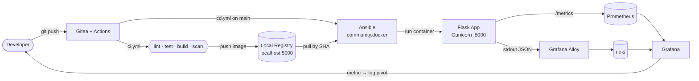
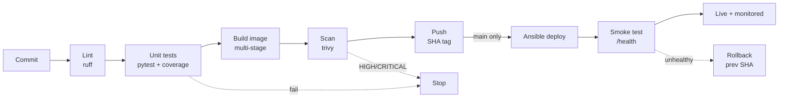
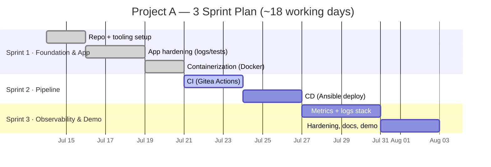
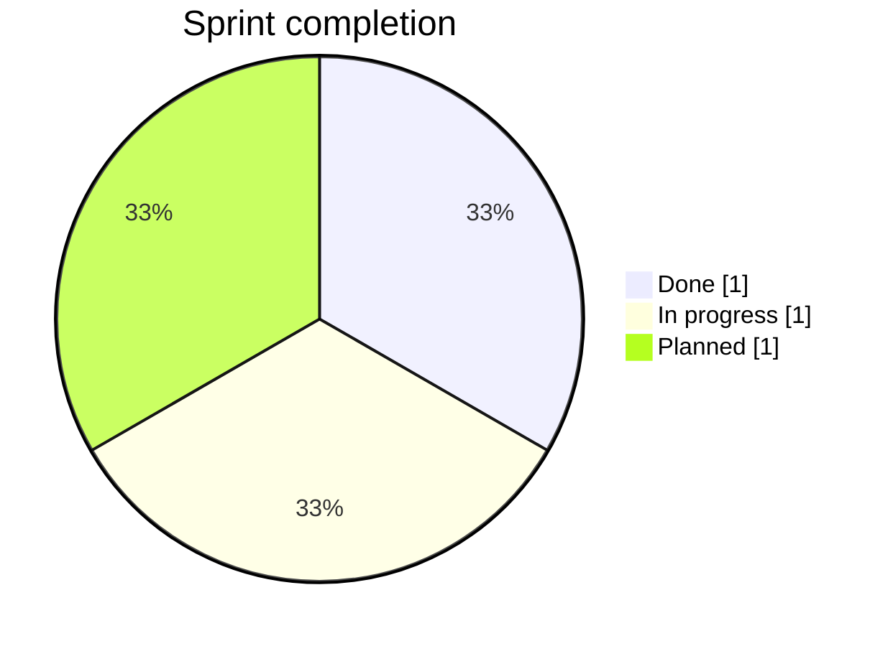

# Project A — Classic CI/CD Pipeline

> Commit → build → test → containerize → deploy → observe. On a plain Docker host, no Kubernetes.
> **TCS DevOps Internship** · Owner: **Milán Takács**


---

## What it does

Automates the full path from a Git commit to a running, monitored container — the classic build-artifact-deploy loop that real pipelines run every day.

```
push  →  CI (lint · test · build · scan · push)  →  CD (Ansible deploy)  →  observe (metrics + logs)
```

## Architecture



## Pipeline flow



## Roadmap — 3 sprints



### Sprint breakdown

| Sprint | Phases | Focus | Exit criteria | Status |
|--------|--------|-------|---------------|:------:|
| **1 · Foundation & App** | 0–2 | Repo, production-grade Flask app, hardened container | `make test lint` green; `docker run` serves all routes | ✅ Done |
| **2 · Pipeline** | 3–4 | Gitea Actions CI + Ansible CD, immutable SHA-tagged artifact | Merge to `main` → new container, smoke test passes, zero manual steps | 🟡 In progress |
| **3 · Observability & Demo** | 5–6 | Prometheus + Grafana + Loki, ADRs, runbook, live demo | Incident walkthrough runs end-to-end in < 60s | ⬜ Planned |

## Progress



| Area | State |
|------|:-----:|
| Flask app: JSON error handling, `/echo` 400, tests | ✅ |
| Hardened Dockerfile (non-root, digest-pinned, healthcheck) | ✅ |
| Dependency locking (pip-tools, hashes) | ✅ |
| Gunicorn WSGI runtime | ✅ |
| CI pipeline (lint → test → build → scan → push) | 🟡 |
| CD with Ansible + smoke test + rollback | ⬜ |
| Prometheus / Grafana / Loki observability | ⬜ |
| ADRs, runbook, demo script | ⬜ |

## Stack

| Layer | Tool |
|-------|------|
| App | Flask 3.1 · Gunicorn |
| SCM + CI | Gitea + Gitea Actions (`act_runner`) |
| Artifact | Docker image → local registry (`localhost:5000`), tagged by git SHA |
| Deploy | Ansible + `community.docker` (idempotent) |
| Metrics | `prometheus_client` · cAdvisor · node_exporter |
| Logs | JSON stdout → Grafana Alloy → Loki |
| Dashboards | Grafana (provisioned as code) |

## Endpoints

| Route | Method | Purpose |
|-------|--------|---------|
| `/` | GET | Hello / build info |
| `/health` | GET | Liveness probe |
| `/echo` | POST | Echo JSON · returns `400` on invalid payload |
| `/metrics` | GET | Prometheus metrics *(planned)* |

## Quick start

```bash
# Run tests
pytest

# Build & run the container
docker build -t flaskapp:dev .
docker run -p 8000:8000 flaskapp:dev

# Verify
curl localhost:8000/health        # {"status":"UP"}
curl -X POST localhost:8000/echo -H 'Content-Type: application/json' -d '{"hi":"there"}'
```

## Docs

| Document | Contents |
|----------|----------|
| [`docs/ProjectA.md`](docs/ProjectA.md) | Original assignment brief |
| [`docs/EXECUTION-PLAN.md`](docs/EXECUTION-PLAN.md) | Full phase plan, ADR summary, risks, TODO |
| [`docs/PROJECT-WORKFLOW.md`](docs/PROJECT-WORKFLOW.md) | Branch & commit workflow |
| [`docs/MANUAL-WALKTHROUGH.md`](docs/MANUAL-WALKTHROUGH.md) | Step-by-step manual run |
| [`docs/DevCheatSheet.md`](docs/DevCheatSheet.md) | Command reference |

---

<sub>Deploy target: local Docker host · No Kubernetes (that's Project C) · Every stage runnable via <code>make</code>.</sub>

