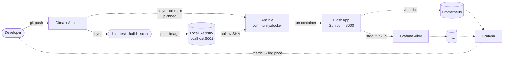
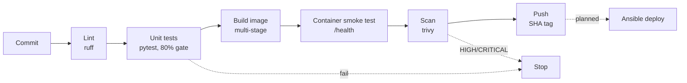

# Project A — Classic CI/CD Pipeline

> Commit → build → test → containerize → deploy → observe. On a plain Docker host, no Kubernetes.
> **TCS DevOps Internship** · Owner: **Milán Takács**


---

## What it does

Automates the path from a Git commit to a running, monitored container — the classic
build-artifact-deploy loop that real pipelines run every day.

```
push  →  CI (lint · test · build · scan · push)  →  CD (Ansible deploy)  →  observe (metrics + logs)
```

CI works today. CD and observability are the remaining phases — see
[`docs/PLAN.md`](docs/PLAN.md) for the roadmap.

## Architecture



Solid lines are built. Dashed lines are planned.

## Pipeline flow



## Status

| Sprint | Focus | Exit criteria | Status |
|--------|-------|---------------|:------:|
| **1 · Foundation & App** | Repo, production-grade Flask app, hardened container | Tests and lint green; `docker run` serves all routes | ✅ Done |
| **2 · Pipeline** | Gitea Actions CI + Ansible CD, immutable SHA-tagged artifact | Merge to `main` → new container, smoke test passes, zero manual steps | 🟡 In progress |
| **3 · Observability & Demo** | Prometheus + Grafana + Loki, ADRs, runbook, live demo | Incident walkthrough runs end to end in under 60 seconds | ⬜ Planned |

| Area | State |
|------|:-----:|
| Flask app: `/`, `/health`, `/ready`, `/echo` with 400 on bad JSON | ✅ |
| pytest suite with an 80% coverage gate in CI | ✅ |
| Hardened Dockerfile: multi-stage, non-root, digest-pinned, healthcheck | ✅ |
| Dependency locking (pip-tools, hashes) | ✅ |
| Gunicorn WSGI runtime | ✅ |
| Platform stack: Gitea + act_runner + local registry via compose | ✅ |
| CI: lint → test → build → smoke test → trivy scan → push | ✅ |
| Structured JSON logging with `request_id` | ⬜ |
| `/metrics` endpoint (`prometheus_client`) | ⬜ |
| CD with Ansible, smoke test and rollback | ⬜ |
| Prometheus / Grafana / Loki observability | ⬜ |
| Runbook and demo script | ⬜ |

## Stack

| Layer | Tool | State |
|-------|------|:-----:|
| App | Flask 3.1 · Gunicorn | ✅ |
| SCM + CI | Gitea + Gitea Actions (`act_runner`) | ✅ |
| Artifact | Docker image → local registry (`localhost:5001`), tagged by git SHA | ✅ |
| Image scanning | Trivy, fails on HIGH/CRITICAL | ✅ |
| Deploy | Ansible + `community.docker` | ⬜ Planned |
| Metrics | `prometheus_client` · cAdvisor · node_exporter | ⬜ Planned |
| Logs | JSON stdout → Grafana Alloy → Loki | ⬜ Planned |
| Dashboards | Grafana, provisioned as code | ⬜ Planned |

## Endpoints

| Route | Method | Purpose |
|-------|--------|---------|
| `/` | GET | Hello message |
| `/health` | GET | Liveness probe — `{"status":"UP"}` |
| `/ready` | GET | Readiness probe — `{"status":"READY"}` |
| `/echo` | POST | Echo JSON back · returns `400` on an invalid payload |
| `/metrics` | GET | Prometheus metrics *(planned)* |

## Quick start

```bash
# Set up the environment
python3.12 -m venv .venv
source .venv/bin/activate
pip install -r requirements-dev.txt

# Run tests and lint
pytest
ruff check .

# Build and run the container
docker build -t flaskapp:dev .
docker run -p 8000:8000 flaskapp:dev

# Verify
curl localhost:8000/health
curl -X POST localhost:8000/echo -H 'Content-Type: application/json' -d '{"hi":"there"}'
```

To bring up the local CI platform (Gitea, runner, registry), see
[`docs/DEVELOPMENT.md`](docs/DEVELOPMENT.md).

## Repository layout

```
.
├── app/                          # Flask application
├── tests/                        # pytest suite
├── platform/                     # compose stack: Gitea, act_runner, registry
├── .gitea/workflows/             # ci.yml
├── docs/                         # plan, development guide, ADRs, assignment brief
├── Dockerfile
├── requirements.in / .txt        # runtime deps (hash-locked)
└── requirements-dev.in / .txt    # dev deps (hash-locked)
```

## Docs

| Document | Contents |
|----------|----------|
| [`docs/PLAN.md`](docs/PLAN.md) | Roadmap, sprint plan, TODO checklist, risks, working conventions |
| [`docs/DEVELOPMENT.md`](docs/DEVELOPMENT.md) | Day-to-day commands, platform operations, Git workflow |
| [`docs/BRANCHING.md`](docs/BRANCHING.md) | Branching strategy, merge policy, `main` protection settings |
| [`docs/adr/`](docs/adr/) | Architecture decision records |
| [`docs/ProjectA.md`](docs/ProjectA.md) | Original assignment brief, kept verbatim as the requirements reference |

---

<sub>Deploy target: local Docker host · No Kubernetes — that is Project C.</sub>
