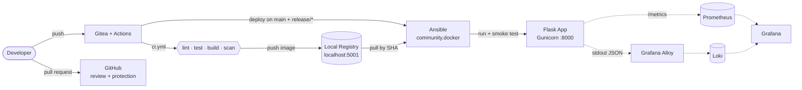
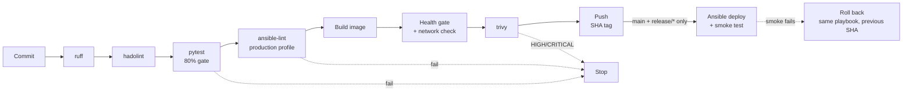

# Project A — Classic CI/CD Pipeline

> Commit → build → test → containerize → deploy → observe. On a plain Docker host, no Kubernetes.
> **TCS DevOps Internship** · Owner: **Milán Takács**


---

## What it does

Automates the path from a Git commit to a running, verified container.

```
push → CI (lint · test · build · scan · push) → CD (Ansible deploy) → observe
```

CI and CD work today. A merge into the current `release/*` branch or `main`
deploys the exact image the pipeline built and verifies it, with zero manual
steps. Observability landed and was verified on 2026-08-11; pipeline control flow is
partial on purpose — see [`docs/PLAN.md`](docs/PLAN.md).

**Review lives on GitHub, the pipeline runs on a self-hosted Gitea.** Neither
forge can do both: Gitea is on `localhost` and unreachable to reviewers, GitHub
has no runner. See [ADR-0004](docs/adr/0004-github-for-review-gitea-for-execution.md).

## Architecture



Solid lines are built. Dashed lines were planned when this diagram was drawn —
all six services run today, see `platform/compose.yaml`.

## Pipeline flow



## Status

| Sprint | Focus | Status |
|---|---|:--:|
| **1 · Foundation & App** | Repo, production-grade Flask app, hardened container | ✅ Done |
| **2 · Pipeline** | Gitea Actions CI + Ansible CD, immutable SHA-tagged artifact | ✅ Done |
| **3 · Observability & Pipeline Control Flow** | Prometheus + Grafana + Loki; conditional stages, timeouts, retry | 🟡 A done, B partial |

| Area | State |
|---|:--:|
| Flask app: `/`, `/health`, `/ready`, `/echo` with 400 on bad JSON | ✅ |
| pytest suite with an 80% coverage gate | ✅ |
| Hardened Dockerfile: multi-stage, non-root, digest-pinned, healthcheck | ✅ |
| Dependency locking (pip-tools, hashes) · Gunicorn runtime | ✅ |
| Platform stack: Gitea + act_runner + registry via compose | ✅ |
| CI: ruff → secret scan → hadolint → tests → ansible-lint → build → health gate → trivy → push | ✅ |
| Every CI tool pinned exactly — Trivy included | ✅ |
| Software inventory / SBOM — 621 components, [`docs/sbom/`](docs/sbom/) | ✅ |
| CD: Ansible deploys that SHA, smoke test gates it | ✅ |
| Reviewed pull requests on GitHub, CODEOWNERS, protection rules configured | ✅ |
| Protection *enforced* — needs a public repository on this plan | ⬜ |
| `ansible-lint` in CI, at the `production` profile | ✅ |
| Rehearsed rollback to a previous SHA — ~37s outage window, three times, [`RUNBOOK.md`](docs/RUNBOOK.md) | ✅ |
| Zero-downtime swap — a bad deploy is live for ~29s before the smoke test fails it | ⬜ |
| Structured JSON logging with `request_id` · `/metrics` endpoint | ✅ |
| Prometheus / Grafana / Loki, provisioned as code · `scripts/loadgen.sh` | ✅ |
| Error-rate → Loki data link · one alert rule, fired by real traffic | ✅ |
| Feature branches build and scan but never push an image — `ref_gate` in `ci.yml` | ✅ |
| `timeout-minutes` on every step that can hang | ✅ |
| Conditional execution, `continue-on-error`, retry — proven in a spike, not yet applied | 🟡 |
| Dynamic fan-out via `fromJSON()` — unsupported by `act_runner` v0.2.12, [ADR-0005](docs/adr/) | ❌ |

## Stack

| Layer | Tool |
|---|---|
| App | Flask 3.1 · Gunicorn |
| Review | GitHub — protected branches, CODEOWNERS |
| CI | Gitea + Gitea Actions (`act_runner`), self-hosted |
| Artifact | Docker image → `localhost:5001`, tagged by git SHA |
| Scanning | hadolint v2.14.0 (Dockerfile) · Trivy 0.72.0 (image, fails on HIGH/CRITICAL) |
| Inventory | CycloneDX SBOMs via Trivy 0.72.0 — [`docs/sbom/`](docs/sbom/) |
| Deploy | Ansible + `community.docker`, inventory-driven |
| Observability | Prometheus · Loki · Grafana · Alloy, provisioned as code |

## Endpoints

| Route | Method | Purpose |
|---|---|---|
| `/` | GET | Hello message |
| `/health` | GET | Liveness — `{"status":"UP"}` |
| `/ready` | GET | Readiness — `{"status":"READY"}` |
| `/echo` | POST | Echo JSON back · `400` on an invalid payload |
| `/metrics` | GET | Prometheus metrics — counters and a latency histogram |

## Quick start

```bash
python3.12 -m venv .venv && source .venv/bin/activate
pip install -r requirements-dev.txt

pytest && ruff check .

docker build -t flaskapp:dev .
docker run -p 127.0.0.1:8000:8000 flaskapp:dev
curl localhost:8000/health
```

For the local CI platform (Gitea, runner, registry) see
[`docs/DEVELOPMENT.md`](docs/DEVELOPMENT.md).

## Repository layout

```
.
├── app/                  # Flask application
├── tests/                # pytest suite
├── ansible/              # CD: inventory, deploy_app role, playbooks
├── platform/             # compose stack: Gitea, act_runner, registry
├── scripts/              # smoke.sh — the checks CI runs, by hand
│                         # rollback-drill.sh — the rehearsal, repeatable
├── .gitea/workflows/     # ci.yml (build-test-push + deploy)
├── docs/                 # plan, dev guide, runbook, ADRs, SBOMs, assignment brief
├── CODEOWNERS            # reviewers, per branch
└── Dockerfile
```

## Docs

| Document | Contents |
|---|---|
| [`docs/PLAN.md`](docs/PLAN.md) | Roadmap, sprints, open work, risks |
| [`docs/DEVELOPMENT.md`](docs/DEVELOPMENT.md) | Commands: app, platform, Ansible |
| [`docs/BRANCHING.md`](docs/BRANCHING.md) | Branches, merge policy, protection |
| [`docs/RUNBOOK.md`](docs/RUNBOOK.md) | Failed deploy, rollback, rehearsal results |
| [`docs/adr/`](docs/adr/) | Why the big decisions were made |
| [`docs/sbom/`](docs/sbom/) | Software inventory — 621 components, six CycloneDX SBOMs |
| [`docs/ProjectA.md`](docs/ProjectA.md) | Original assignment brief, verbatim |

---

<sub>Deploy target: local Docker host · No Kubernetes — that is Project C.</sub>
